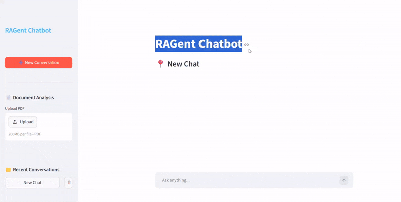

# 🤖 RAGent Chatbot

**Multi-Utility AI Chatbot with LangGraph, FastAPI, Streamlit, RAG, Tool Calling, and Threaded Conversations**

ChatThread AI is a **full-stack AI assistant platform** built using **LangGraph, LangChain, FastAPI, Streamlit, SQLite, FAISS, and Ollama-based LLMs**.  
It combines **general conversational AI**, **tool-augmented reasoning**, **persistent multi-thread chat management**, and **document-based question answering** into one practical chatbot system.

The application is designed to behave like a modern AI assistant where users can:

- chat normally with the assistant
- maintain **multiple independent conversation threads**
- upload **PDF documents** and ask questions from them using **RAG**
- use external tools such as **Wikipedia, ArXiv, web search, and stock lookup**
- automatically generate conversation titles
- revisit, load, and delete past conversations from a persistent chat history

---

## 🎥 Demo



---

## 📌 Table of Contents

- [Project Overview](#-project-overview)
- [Key Features](#-key-features)
- [Tech Stack](#-tech-stack)
- [Project Structure](#-project-structure)
- [How It Works](#-how-it-works)
- [Setup Instructions](#-setup-instructions)
- [Acknowledgement](#-acknowledgement)
- [Contact](#-contact)

---

## 🚀 Project Overview

This project was built to move beyond a basic chatbot and create a **multi-utility AI assistant** with both **general conversation** and **document intelligence** capabilities.

It combines:

- **LLM-based conversation**
- **LangGraph-based tool routing**
- **chat memory and thread management**
- **PDF question answering using RAG**
- **frontend + backend full-stack architecture**
- **persistent storage with SQLite**
- **modular backend services for scalability**

In simple terms, this is a chatbot system that can both **chat like an assistant** and **answer questions from uploaded documents**, while also using tools for factual and live information.

---

## ✨ Key Features

### 💬 Multi-Thread Chatbot
- Supports **multiple independent chat conversations**
- Each conversation gets a unique `thread_id`
- Users can revisit old conversations from the sidebar
- Makes the chatbot more practical and ChatGPT-like

### 🧠 Tool-Augmented AI Assistant
The chatbot can use external tools when needed, including:

- **Wikipedia Search** → for factual information
- **ArXiv Search** → for research paper queries
- **Web Search** → for current or broader web information
- **Stock Price Lookup** → for finance-related queries
- **RAG Tool** → for answering questions from uploaded PDFs

### 📄 PDF Question Answering with RAG
Users can upload a PDF and ask questions directly from the document.

The system:
- reads the PDF
- splits it into chunks
- converts chunks into embeddings
- stores them in a **FAISS vector store**
- retrieves relevant chunks during chat
- sends them to the LLM as context for grounded answers

### 🏷️ Automatic Conversation Title Generation
After a conversation starts, the system generates a short title automatically using the LLM.

Examples:
- “CNN Architecture”
- “Stock Market Analysis”
- “RAG Pipeline Design”

This makes the sidebar more useful than showing random IDs.

### 🧵 Persistent Conversation Management
The chatbot stores conversation metadata using **SQLite**, including:
- thread ID
- title
- timestamps

This enables:
- loading previous conversations
- showing recent chats
- deleting threads
- maintaining a more realistic AI assistant experience

### 🌐 Full-Stack AI Chatbot Architecture
The project follows a modular **frontend + backend + database** structure:

- **FastAPI** for APIs and backend orchestration
- **LangGraph** for chatbot workflow and tool routing
- **Streamlit** for the web UI
- **SQLite** for thread persistence
- **FAISS** for vector retrieval over uploaded PDFs

---

## 🛠 Tech Stack

## Backend
- **FastAPI** – REST API layer
- **LangGraph** – chatbot workflow orchestration
- **LangChain** – prompts, tools, and RAG pipeline
- **Ollama / ChatOllama** – LLM integration
- **SQLite + aiosqlite** – thread metadata and checkpointing
- **FAISS** – vector database for PDF semantic search
- **PyPDFLoader** – PDF ingestion
- **RecursiveCharacterTextSplitter** – document chunking
- **Pydantic** – request validation

## Frontend
- **Streamlit** – chatbot UI and PDF upload interface

## Utilities / Supporting Tools
- **requests** – frontend-backend communication
- **uuid** – thread generation
- **python-dotenv / os** – environment configuration
- **uv** – dependency and environment management

---

## 📂 Project Structure

```text
ChatThread-AI/
│
├── Backend/
│   ├── main.py              # FastAPI entry point and API routes
│   ├── config.py            # Model names, DB path, project settings
│   ├── database.py          # SQLite thread operations + checkpoint setup
│   ├── llm.py               # LLM and embedding initialization
│   ├── llm_graph.py         # LangGraph workflow and routing logic
│   ├── rag.py               # PDF ingestion, chunking, FAISS retriever creation
│   ├── tools.py             # RAG, Wikipedia, ArXiv, web search, stock tools
│   └── models.py            # Pydantic request models
│
├── Frontend/
│   └── app.py               # Streamlit UI
│
├── Database/
│   ├── chatbot.db
│
├── .env
├── requirements.txt / pyproject.toml
└── README.md
````

---

## ⚙️ How It Works

### 1. Start a Conversation

* User opens the Streamlit app
* A new chat thread is created (or an old one is loaded)

### 2. Send a Message

* User sends a message from the frontend
* Streamlit sends it to the FastAPI backend

### 3. LangGraph Processes the Request

* The backend passes the message to the **LangGraph workflow**
* The LLM decides whether it can answer directly or whether a tool is needed

### 4. Tool Calling (if required)

Depending on the query, the chatbot may call:

* **Wikipedia**
* **ArXiv**
* **Web Search**
* **Stock Price Tool**
* **RAG Tool for uploaded PDFs**

### 5. Final Response Generation

* Tool outputs are returned to the graph
* The LLM uses that context to generate the final response
* FastAPI sends the response back to Streamlit

### 6. PDF-Based Q&A (RAG Flow)

If a user uploads a PDF:

* the file is sent to `/upload-pdf/{thread_id}`
* the backend loads the PDF
* text is split into chunks
* embeddings are created
* chunks are stored in **FAISS**
* a retriever is created for that thread
* later, document-related questions use **RAG retrieval** to answer from the uploaded file

---

## ⚙️ Setup Instructions

### 1. Clone the Repository

```bash
git clone https://github.com/Umer2900/Chatbot.git
cd Chatbot
```

### 2. Create Environment and Install Dependencies

#### Using `uv` (recommended)

```bash
uv venv
# Activate the environment
# Windows:
.venv\Scripts\activate

# Mac/Linux:
source .venv/bin/activate

uv pip install -r requirements.txt
```

> If you are using `pyproject.toml`, replace the last command with:

```bash
uv sync
```

#### Using pip

```bash
python -m venv venv
# Activate the environment, then:
pip install -r requirements.txt
```

---

### 3. Add Environment Variables

Create a `.env` file and add your required API keys / configuration.

Example:

```env
TAVILY_API_KEY=your_tavily_key
ALPHA_VANTAGE_API_KEY=your_alpha_vantage_key
```

Add any other variables required by your project setup.

---

### 4. Start the FastAPI Backend

```bash
uv run python Backend/main.py
```

If you run with Uvicorn instead:

```bash
uv run uvicorn Backend.main:app --reload
```

---

### 5. Start the Streamlit Frontend

```bash
uv run streamlit run Frontend/app.py
```

---

## 🙌 Acknowledgement

This project was built as an **end-to-end LLM + RAG + Full-Stack AI Application project** covering:

- LLM-powered conversational AI  
- LangGraph-based workflow orchestration  
- Tool calling with external knowledge sources  
- Retrieval-Augmented Generation (RAG) for PDF question answering  
- Vector search using FAISS and embeddings  
- Multi-thread chat management with persistent storage  
- FastAPI backend API development  
- Streamlit frontend development  

It is designed as a hands-on project to demonstrate how a modern AI assistant moves from:

**user query → LLM reasoning → tool/RAG retrieval → response generation → chat persistence → frontend interaction**

---

## 📬 Contact

**Mohammad Umer Jan**
B.Tech CSE | Data Science Enthusiast | Generative AI / ML / MLOps Learner

* GitHub: [Umer2900](https://github.com/Umer2900)

